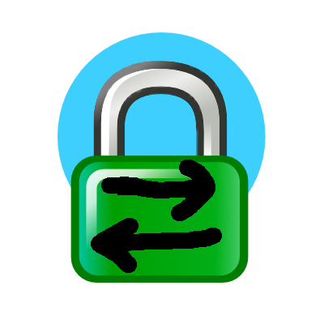

#  balenaCaddyReverser

## Status
* Works!!!
* Needs to be documented properly
* Uses device variables to config the Caddyfile
* Wildcard certificates are working!!
* ACME provisioning works (digital ocean tested sat)
* The python is pretty janky...

## TODO
1. Document
2. Figure out how to publish as an app on [Balena Hub](https://hub.balena.io)
3. Test other DNS providers for the ACME provisioning

## Device Variables
|Name|Value|Notes|
|---|---|---|
|HOST_\<number>| \<host>\|\<domain>\|\<ip>\|\<port>\|\<wildcard (true or false)>|The name must start with `HOST_` and have a number. Example name: `HOST_13` The values must separated with the pipe symbol `\|`. Example value: `nodered\|awesomedomain.com\|192.168.0.13\|4200\|true` If you aren't sure why/if you need a wildcard... set it to `false`|
|DNS_PROVIDER|digitalocean|This is the value provided to the ACME DNS Challenge and is also used to build the DNS Provider mod. It needs to be set in the [docker-compose.yml]('docker-compose.yml') and set as a device variable. |
